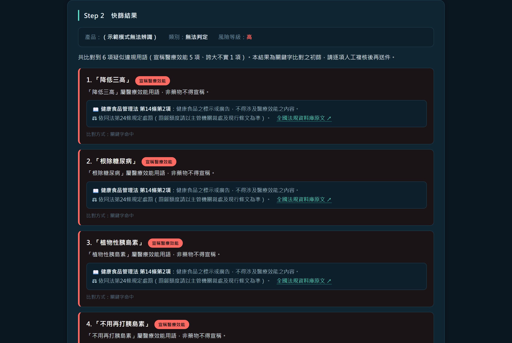

# AI 違規廣告快篩與一鍵通報系統

上傳一張廣告截圖，自動讀出圖上的字、比對 719 個違規用語、列出涉違反的法條與罰則，
並生成可直接寄給衛生局的陳情信。涵蓋**食品、健康食品、化粧品、藥品、醫療器材**五類廣告。

**線上直接試用（免安裝）** → https://pyhsu-cyber.github.io/AI-Powered-Ad-Screening/


> **這是初篩工具，不是裁決系統。** 命中結果一律需人工複核，最終違規認定以主管機關為準。
> 設計上刻意「寧可多列一項讓你排除，也不要漏掉違規句」，所有自動判定的結果都可以修改。

---

## 它解決什麼問題

看到一則可疑的保健食品或化粧品廣告，想檢舉時要面對的是：這句話違反哪一部法？第幾條？
罰鍰級距多少？陳情信該怎麼寫？——這套工具把這段流程從人工翻法規壓縮到幾分鐘。



---

## 主要功能

| 功能 | 說明 |
|---|---|
| **雙 OCR 引擎** | Windows 內建 OCR（離線、約 1 秒）為主，瀏覽器 tesseract.js 為備援並自動背景交叉比對補漏 |
| **框選辨識** | 用左鍵在預覽圖上拖出一塊，就只辨識那一塊並接進「廣告文字」。同一張圖可以重複框，每塊各自成一行。整張讀常會把頁尾、浮水印、旁邊留言一起讀進來，密集圖表更是整片糊掉；框選還會把小塊單獨放大到辨識引擎的舒適區 |
| **拖曳／Ctrl+V 直接分析** | 圖片丟在頁面任何地方都會接住並自動開始分析，不必捲回上面按按鈕；分析完換下一張就是「再丟一次」這一個動作 |
| **OCR 幻覺行濾除** | tesseract 偶爾會對同一塊區域吐出兩個競爭的行假設，其中一個是憑空的亂碼。用 bbox 重疊而非信心門檻判定，所以不會誤殺「讀得很爛但真的存在」的內容 |
| **OCR 多趟補讀與可靠度提示** | 小字自動放大、對比拉伸第二讀、多趟結果取聯集；辨識信心過低時明講「這次辨識不可靠，請逐字核對」 |
| **719 個違規關鍵字** | 來自食藥署認定基準、化粧品認定準則附件、衛福部公告詞句例示與各縣市衛生局實際裁處案例（詳見 [關鍵字來源](說明文件/關鍵字來源.md)） |
| **證據等級三級** | 每個關鍵字標明依據強度：有實際裁處案例 286 / 主管機關明文例示 361 / 僅依法規推論 72。陳情信會逐詞列出依據，只是推論的標示「疑似違規，惠請貴局本於職權認定」，不會講得像已經定讞 |
| **健康食品許可證比對（離線）** | 廣告寫了健字號就自動查內建的食藥署快照（565 筆），列出核准的保健功效與宣稱原文；核准範圍內的用語不列為違規，也不寫進陳情信。查無字號時只說「本快照查無」並附官方查詢連結，不會逕自主張「未經核准」 |
| **法定警語語境排除** | 「糖尿病患者食用前請諮詢醫師」是負責任的標示不是違規；「超高溫殺菌」「再生紙材」「耐磨損」是製程與包材敘述。這些不會被誤判，但「三個月改善高血壓，請諮詢醫師」這種拿警語當擋箭牌的寫法仍會命中 |
| **事前核准制與法域外偵測** | 藥品／醫療器材是事前核准制，工具無從判斷有無核准文號，會明講並改為請主管機關查核；寵物食品、嬰兒配方、電子煙不在這五部法規範圍內，會擋下並指出正確的主管機關 |
| **依產品類別引用正確法條** | 同一句「宣稱療效」，食品引食安法、化粧品引化粧品法、醫療器材引醫療器材管理法，罰鍰級距各不相同 |
| **關鍵字品類過濾** | 化粧品專屬用語（漢方、療程、雷射）不會套到食品廣告上，反之亦然 |
| **陳情信生成** | 按廣告原句聚合、引錄廣告全文、列印自動附上截圖並轉白底黑字 |
| **全程本機執行** | 免費模式不需任何 API 金鑰，圖片與檢舉人個資不會離開這台電腦 |

---

## 兩種使用方式

| | 線上版 | 桌面版 |
|---|---|---|
| 網址／取得 | [pyhsu-cyber.github.io/AI-Powered-Ad-Screening](https://pyhsu-cyber.github.io/AI-Powered-Ad-Screening/) | [Releases](../../releases) 下載 zip |
| 安裝 | 免安裝，開網頁即用 | 解壓縮後雙擊 exe |
| 文字辨識 | 瀏覽器 OCR（約 5 秒，首次下載模型 9 MB） | Windows 內建 OCR（約 1 秒）＋瀏覽器 OCR 交叉比對 |
| 平台 | 任何裝置，含手機 | Windows 10 / 11 |
| 隱私 | 全程在瀏覽器內執行，圖片不上傳 | 全程在本機執行 |

兩版功能相同（違規比對、法條對應、陳情信生成）。桌面版多一套 Windows OCR，
辨識較快且會自動交叉比對補漏。

## 快速開始（桌面版）

1. 到 [Releases](../../releases) 下載最新版 zip 並解壓縮
2. 雙擊 `違規廣告快篩.exe`（Windows 首次執行會攔截，點「其他資訊」→「仍要執行」）
3. 瀏覽器會自動開啟 `http://localhost:8765`
4. 上傳廣告截圖（或按 <kbd>Ctrl</kbd>+<kbd>V</kbd> 貼上）→ 開始快篩分析

完整操作說明見 [`功能使用說明書.html`](功能使用說明書.html)（可離線開啟與列印）。

### 環境需求

- Windows 10 / 11
- 繁體中文 OCR 語言套件（Windows 內建；沒有的話會自動改用瀏覽器 OCR）
- Chromium 核心瀏覽器（Chrome / Edge）

---

## 專案結構

```
違規廣告快篩.exe        主程式（PyInstaller 單檔封裝）
ocr.ps1                 Windows.Media.Ocr 一次性 CLI 腳本
VERSION                 版號唯一來源 ← build.py 讀它並反查各文件是否一致
regulations.json        法規、違規關鍵字與品類範圍 ← 唯一真相來源
健康食品許可證.json      食藥署健康食品資料集快照（565 筆，離線比對用）
static/index.html       操作介面（build.py 產生，勿手改）

實作作業/               前端原始碼
  index.html  styles.css  app.js
  build.py              產生 static/index.html 與 docs/index.html，注入法規資料
                        與健康食品快照，並檢查各文件版號是否與 VERSION 一致
  package.py            打包成 版本封存/違規廣告快篩_vN.zip（含機敏檔案複驗）
  update_healthfood.py  從 TFDA 開放資料更新健康食品快照（需連網，平常不必跑）

docs/                   GitHub Pages 線上版（純瀏覽器，不需要 exe）

backend/                Flask 後端重實作（規格與測試夾具，尚未接線）
tests/                  pytest 測試
SPEC/                   需求規格書（FR / EC / NFR / AC）
說明文件/               版本紀錄、關鍵字來源與依據
測試資料/               合成測試圖 + 真實案例/（取自實際裁處案件）
設計素材/               logo 與介面設計參考
```

### 為什麼前端要建置

`違規廣告快篩.exe` 的內建伺服器只服務四個路徑：

| 路徑 | 回應 |
|---|---|
| `/` 與 `/index.html` | 讀 `static/index.html` |
| `/api/status` | 是否已設定 AI 金鑰 |
| `/api/analyze` | OCR 與法規比對 |

**其餘路徑一律 404**，所以 CSS、JS、圖片都必須內嵌成單一 HTML。改前端請改 `實作作業/` 的原始檔，
然後執行：

```bash
cd 實作作業
python build.py
```

一次會產出兩個版本：`static/index.html`（桌面版，走 `/api/analyze`）與
`docs/index.html`（線上版，前端自己比對）。同一份原始碼靠啟動時偵測 `/api/status`
是否存在來決定走哪條路，不需要分岔維護。

---

## 維護違規關鍵字

編輯 `regulations.json` 的 `demo_keywords`，兩個分類：

- `medical_efficacy` — 宣稱醫療效能
- `exaggeration` — 誇大不實

**改完必須關掉程式重開**（`regulations.json` 是啟動時載入一次的，重整網頁沒用）。

比對是**純子字串比對**，沒有語意判斷，新增關鍵字有五條規則：

| 規則 | 原因 |
|---|---|
| 不要收錄包含既有關鍵字的詞 | 已有「治療」再加「治療糖尿病」，同一句會被算成兩筆 |
| 一個詞只能歸一類 | 放兩邊會重複計算 |
| 不要收錄法規明文允許的宣稱 | 「養顏美容」「淡化細紋」「緊緻毛孔」收了會誤判合法廣告 |
| 不要收錄太通用的詞 | 「改善」「有效」「健康」會到處誤判 |
| **必須用裁處書原文測試** | 收改寫過的說法會變成永遠不會觸發的死鍵字 |

每個關鍵字的法規依據與出處見 [`說明文件/關鍵字來源.md`](說明文件/關鍵字來源.md)。

---

## 測試

```bash
python -m pytest backend tests -q      # 全部
python tests/test_whitelist.py         # 也可以單獨跑任何一支，會印出逐項結果
```

現行測試基線（共 **367 項檢查 / 11 支測試檔**，全數通過）：

| 測試檔 | 項數 | 守什麼 |
|---|---:|---|
| `backend/test_smoke.py` | 7 | schema / validators / fixtures 能正確載入 |
| `backend/test_app_smoke.py` | 20 | Flask 路由與 analyzer 冒煙測試 |
| `backend/test_security.py` | 25 | 速率限制、安全標頭、個資遮蔽 |
| `backend/test_api_spec.py` | 10 | 請求／回應符合 JSON Schema |
| `tests/test_unit.py` | 79 | 驗證器與資料模型 |
| `tests/test_e2e.py` | 64 | 主流程與回應結構 |
| `tests/test_uat.py` | 37 | 驗收情境（含邊界輸入） |
| `tests/test_whitelist.py` | 38 | **法規明文允許的宣稱不得被判違規**、語境排除、資料庫自身一致性 |
| `tests/test_healthfood.py` | 31 | 健康食品許可證快照、核准範圍排除 |
| `tests/test_ocr_filter.py` | 25 | OCR 幻覺行濾除，且不誤殺低信心的真實內容 |
| `tests/test_region_pick.py` | 31 | 框選辨識的接續與去重、換圖清空文字 |

其中 `test_healthfood.py`、`test_ocr_filter.py` 與 `test_region_pick.py` 會用 node 直接跑**出貨產物
`static/index.html` 裡的那份程式碼**（不是另寫一份等價實作）；機器上沒有 node
就只跑資料層檢查並印 INFO，不會變成硬相依。

真實裁罰案例召回：18 / 18（`測試資料/真實案例/`）。

`測試資料/真實案例/` 的違規測試圖，文案取自主管機關實際裁處案件的廣告原文
（關捷挺固立罰 1,124 萬、FORTE 面膜罰 529 萬等）。

合法對照組刻意**不用「市面上沒被罰的廣告」**——沒被罰不等於合法，
改用法規明文列為「得使用」的詞句，這是唯一有法源依據的非違規樣本。

---

## 已知限制

1. **只抓字面用語**。隱喻、暗示、諧音抓不到（例如以「管路」影射血管）。
   食藥署明示違規認定採「整體表現綜合判斷」，本工具無法取代人工判讀。
2. **改寫過的說法會失效**。關鍵字必須與廣告原文逐字相符。
3. **無法查證許可證**。領有健康食品許可證者得合法宣稱「調節血脂」等保健功效，
   但本工具讀不到字號的效力，一律標示出來讓人工判斷
   （見 `測試資料/真實案例/R7_已知限制_領證健康食品.png`）。
4. **產品類別需人工選擇**。免費模式的後端永遠回「無法判定」，選錯會引用到錯誤的法條。
5. `backend/` 為規格與測試夾具，**尚未與前端接線**，與 exe 的行為存在定義落差。

---

## 免責聲明

- AI 與關鍵字判定僅供參考，實際違規認定與裁罰以主管機關為準。
- 法條內容請以[全國法規資料庫](https://law.moj.gov.tw/)現行條文為準。
- 檢舉獎金依各縣市檢舉獎勵辦法核發，金額以主管機關核定為準。
- 測試資料中引用的案件皆為主管機關已公開之裁處資料，測試圖為說明用素材，
  非各該廠商之實際廣告。

---

## 授權

**著作權所有，保留一切權利** — Copyright (c) 2026 許必瑜 (Pi-Yu Hsu)

本專案公開於 GitHub 僅供閱覽與展示，**未授予任何使用、重製、修改或散布的權利**。
如需使用請事先取得書面同意。詳見 [LICENSE](LICENSE)。

第三方元件（tesseract.js、Python 執行環境、Windows.Media.Ocr）依其原授權條款釋出。

## 版本

各版變更與驗證結果見 [`說明文件/版本紀錄.md`](說明文件/版本紀錄.md)。
可執行的封裝檔在 [Releases](../../releases)。
